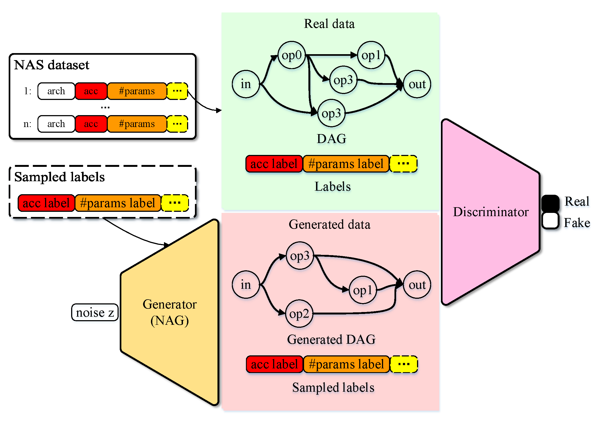
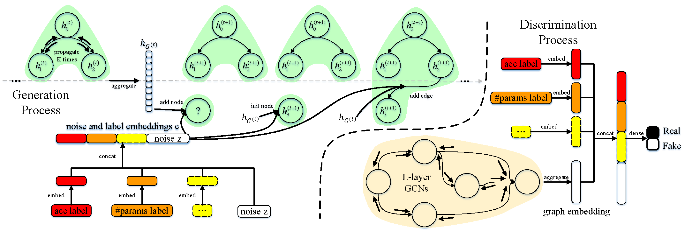
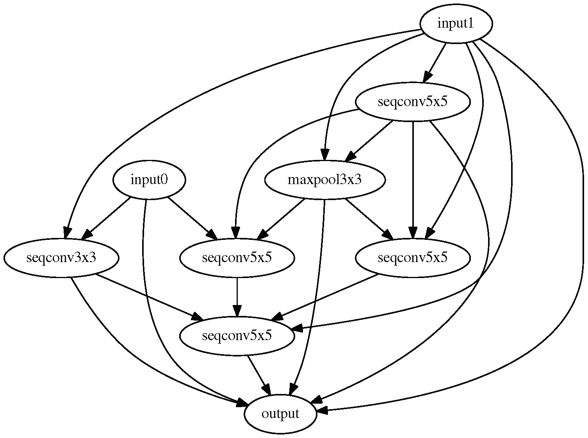
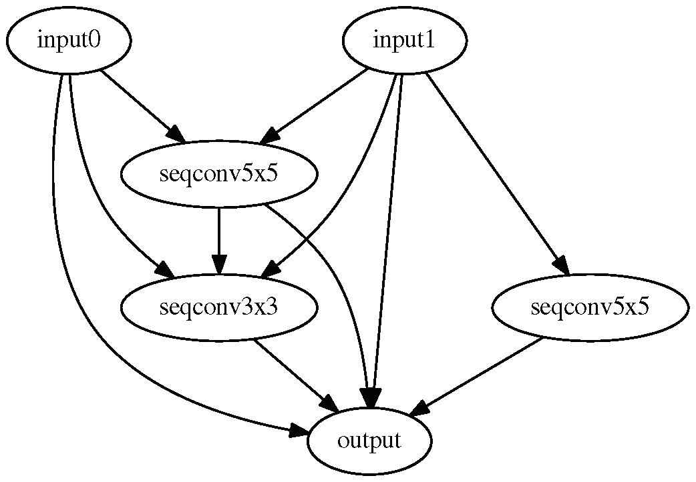

# A Neural Architecture Generator for Efficient Search Space

This repository is the official implementation of [A Neural Architecture Generator for Efficient Search Space](https://www.sciencedirect.com/science/article/pii/S0925231221016994).

<p align="center">
    
</p>
<p align="center">
    The overview of NAG.
</p>

<p align="center">
    
</p>
<p align="center">
     The generator and discriminator of NAG.
</p>

## Citation

If you use any part of this code in your research, please cite our paper:

```
@inproceedings{jing2021nag,
  title={A Neural Architecture Generator for Efficient Search Space},
  author={Kun Jing, Jungang Xu, and Zhen Zhang},
  booktitle={Neurocomputing},
  year={2021}
}
```

## Requirements

```setup
Python>=3.6, PyTorch==1.1.0, torchvision==0.2.1, graphviz=0.10.1
```

## Datasets

### Task Datasets

We consider three benchmark classification datsets, including CIFAR-10, CIFAR-100, and ImageNet.

### NAS Datasets

For searching on NAS-Bench-101, NAS dataset is obtained by randomly sampling [NAS-Bench-101](https://github.com/google-research/nasbench).

For searching, training, and evaluating on task datasets, the code [build_nas_dataset/build_nas_dataset.py](https://github.com/kunjing96/NAG/build_nas_dataset/build_nas_dataset.py) train and evaluate the sampled child architectures with a one-shot model to build NAS Dataset.

## Training NAG on NAS-Bench-101

We do not provide the code for searching on NAS-Bench-101.

## Training NAG on CIFAR-10 (Open Domain Search)

### Single-Objective

To train the NAG for designing architectures with single-objective on CIFAR-10 in the paper, run this command:

```train_ganas
python gan.py
```

To generate some architectures with customized requirements (for accuracy) after training in the paper, run this command:

```infer
python generate_archs.py
```

### Multi-Objective

To train the NAG for designing architectures with multi-objective on CIFAR-10 in the paper, run this command:

```train_ganas
python gan_multiobj.py
```

To generate some architectures with customized requirements (for accuracy and number of parameters) after training in the paper, run this command:

```infer
python generate_archs_multiobj.py
```

## Training Architecture on CIFAR-10

To train the discovered architecture on CIFAR-10 in the paper, run this command:

```train
python train_cifar.py
```

## Training Architecture on CIFAR-100

To train the discovered architecture on CIFAR-100 in the paper, run this command:

```train
python train_cifar.py --dataset cifar100
```

## Training Architecture on ImageNet

To train the discovered architecture on ImageNet in the paper, run this command:

```train
python train_imagenet.py
```

## Results

### The Discovered Architecture

<p align="center">
    
</p>
<p align="center">
     Normal cell.
</p>

<p align="center">
    
</p>
<p align="center">
     Reduction cell.
</p>

### Results on CIFAR-10

| Architectur                             | Top 1 Error (%) | #Params (M) | Search Cost (GPU days) |
| --------------------------------------- |---------------- |------------ |----------------------- |
| RS-NAG(high acc)+cutout                  |       2.73      |     4.3     |            6           |
| RS-NAG(few params, high acc)+cutout      |       3.56      |     1.1     |            4           |
| RS-NAG(medium params, high acc)+cutout   |       2.86      |     3.0     |            4           |
| RS-NAG(large params, high acc)+cutout    |       3.26      |     4.1     |            4           |
| RS-NAG(ensemble model)+cutout            |       3.37      |     4.5     |            4           |

### Results on CIFAR-100

| Architecture                            | Top 1 Error (%) | #Params (M) | Search Cost (GPU days) |
| --------------------------------------- |---------------- |------------ |----------------------- |
| RS-NAG(high acc)+cutout                  |      19.57      |     4.3     |            6           |

### Results on ImageNet

| Architecture                            | Top 1 Error (%) | Top 5 Error (%) | #Params (M) | Search Cost (GPU days) |
| --------------------------------------- |---------------- |---------------- |------------ |----------------------- |
| RS-NAG(high acc)                 |       27.2      |       9.1       |     5.0     |            6           |

## Contributing

The codes and models in this repo are available under the GNU GPLv3 license. If you think something important is missing or should be different, I'd love to hear it! If you have suggestions for improvement, open an issue on this project.